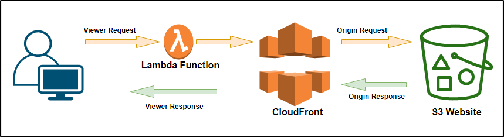

### 03-secret-app
## Home Assignment - Part III
# Introduction
This is an automated deployment of a static website on aws s3 with basic authentication. Terraform will be used as infrastructure-as-code (IAC) to achieve this.

**AWS Services Used**
- **S3**
- **IAM**
- **CloudFront**
- **Lambda**

# Project Design

**Steps**
- A *viewer request* is sent from the browser to the Cloudfront distribution which triggers a Lambda function (this prompts the user for a username and password)
- The Lambda function is a javascript callback function that does the basic authentication
- Once the user is authenticated, the Cloudfront distribution sends an *origin request*  via a secret header to the S3 bucket serving the secret web app
- The S3 bucket sends back an *origin response* to the Cloudfront distribution once it validates the *origin request* via the secret header
- Cloudfront distribution sends back a viewer response to the end user which then serves secret web app page on the browser

